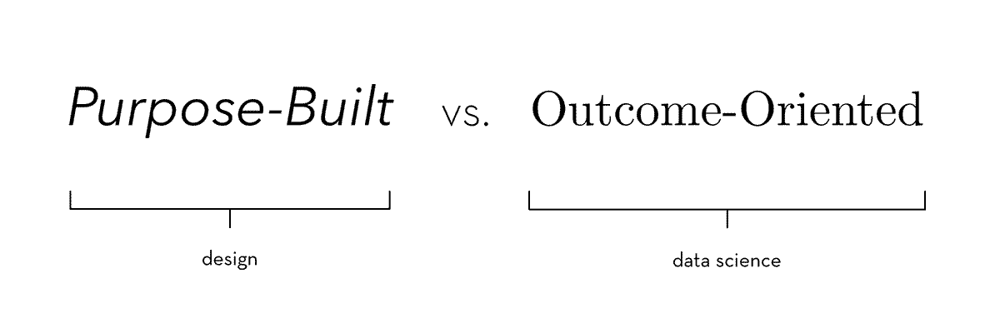

---
# This page uses Hydejack's `about` layout, which shows the primary author's picture and about text at the top.
layout: about
cover: true

# The title of the page.
title: Information

# You can show the description on the page by deleting this line:
hide_description: true

# Setting `menu` will generate an entry in the sidebar.
menu: true
order: 1

# This description is used to preview the page on search engines, social media, etc.
description: >
  A course at the Stanford d.School on the intersection of Design
  and ML (machine learning) that is offered in the Winter quarter
  of 2018-2019
---

Designing Machine Learning is a project by the [Stanford d.School] to make Machine Learning (ML) more accessible to innovators from all disciplines. We believe that ML will soon be a widespread feature of products, services, systems, and experiences in all walks of life. In order to make this computational revolution possible, as well as to ensure that it closely follows human values, we must empower a new generation of professionals to incorporate ML into their creative process.

**Quick Navigation**
* TOC
{:toc}

## Motivation
Design is the exploration of possibility, at once a critique of the present and a supreme optimism about human ingenuity. In a way, machines are design made manifest. Machines are programmable constructs, giving limitless potential and new forms of agency to the designer. Machine learning is yet another axis of empowerment, still incipient in its capabilities. Perhaps it is the humility with which we have previously approached machine learning that has prevented us from applying it pervasively, or exposing it to wider inquiry.
{:.lead}

Traditionally, designers have differed from data scientists in their approach to building systems and their metrics of measuring success. At its core, this is a difference of _values_ that pervades each field. Data science is statistical and numerical, with focus placed on standardized measures, such as "training versus test accuracy". To designers, this (and many other) metrics are essentially arbitrary. What matters to designers is the human value ascribed to the experience of the product. How do we reconcile this stark contrast?

{:.lead data-width="1200" data-height="400"}
The discontinuity in values between fields
{:.figure}

## Course Information

### Office Hours

As a courtesy, for appointments please schedule at least four hours in advance to give us time to prepare.

* **Abhay's Office Hours**: [Abhay's Scheduling Link]
* **Michelle's Office Hours**: By appointment via e-mail (michelle.r.carney@gmail.com) and Wednesdays from 2PM-3PM in d.School Bay Studios (please e-mail to confirm space). 
* **Anand's Office Hours**: By appointment via e-mail (datawocky@gmail.com).

[Abhay's Scheduling Link]: https://calendly.com/abhayka/office-hours/

### Week 1

Topics covered: Intro to Machine Learning, Decision-Making Systems, Class Logistics.

_Assignments Due Next Week_
* Take the course [intro survey](https://goo.gl/forms/lK4H0575xNES8Mox1)

_Readings Due Next Week_
* [Deloitte: State of AI in Enterprise]
* [Quartz: The Data that Transformed AI Research]
* [The Verge: Wikipedia Engages Nuclear Option]
* [Human-Centered Machine Learning]

[Deloitte: State of AI in Enterprise]: https://www2.deloitte.com/content/dam/insights/us/articles/4780_State-of-AI-in-the-enterprise/DI_State-of-AI-in-the-enterprise-2nd-ed.pdf
[Quartz: The Data that Transformed AI Research]: https://qz.com/1034972/the-data-that-changed-the-direction-of-ai-research-and-possibly-the-world/
[The Verge: Wikipedia Engages Nuclear Option]: https://www.theverge.com/2018/12/4/18125359/wikipedia-trump-admin-account-security-hack
[Human-Centered Machine Learning]: https://medium.com/google-design/human-centered-machine-learning-a770d10562cd 

### Week 2

Topics covered: Understanding the Data Science Pipeline. Data Collection Systems. Content Filtering in Wikipedia

_Assignments Due Next Week_
* Presentations for first guided investigation, [Wikipedia Abuse Filter]

_Readings Due Next Week_
* [Recommender Systems: From Algorithm to User Experience]
* [Algorithms in practice: Comparing web journalism and criminal justice]
* [The Netflix Prize: How a $1 Million Contest Changed Binge-Watching Forever]

[Wikipedia Abuse Filter]: https://docs.google.com/document/d/1aoXaOgUrgEtpvFxt-vZGKLrc6JXjWwU3HM69opsBo4s/edit?usp=sharing
[Recommender Systems: From Algorithm to User Experience]: https://link.springer.com/article/10.1007/s11257-011-9112-x
[Algorithms in practice: Comparing web journalism and criminal justice]: https://journals.sagepub.com/doi/abs/10.1177/2053951717718855
[The Netflix Prize: How a $1 Million Contest Changed Binge-Watching Forever]: https://www.thrillist.com/entertainment/nation/the-netflix-prize

[Stanford d.school]: http://dschool.stanford.edu